
<h1 align="center">基于java 的病房管理系统+vue</h1>

## 简介
病房管理系统：角色分为管理员、医护人员、患者；提供病床管理、患者信息管理、药品管理、医护人员管理、病房使用记录等功能模块，支持信息录入、查询、修改、删除和权限管理。    --计算机毕业设计源码；毕设源码；java毕业设计源码

## 联系方式

<h3 align="center">获取完整代码与数据库文件 + 微信：deepguan QQ: 86050149 QQ群: 783742310</h3>

<h3 align="center">可帮忙远程部署 包运行成功！提供远程部署、修改代码、设计文档指导、代码讲解等服务！</h3>

## 功能介绍（完整见运行截图）
管理员：管理员负责整体系统的维护和管理，包括管理医护人员和患者信息，管理病床和药品库存，分配和记录病床使用情况等。管理员可以通过系统查看和修改所有数据，进行用户管理，包括添加、删除、查看和修改用户信息。同时，管理员可以进行查询和筛选操作，以便快速查找相关信息，并拥有重置用户密码的权限。此外，管理员还可以管理药品信息，包括增删查改库存记录，以确保医院运作的高效有序。

医护人员：医护人员的主要职责是管理病房和患者的信息，确保患者收到适当的护理和治疗。系统提供医护人员查看和编辑患者信息的功能，包括录入新的病床和患者使用记录，以及管理病床状态。医护人员可以查看患者详细信息、添加新的患者记录、修改和更新患者信息，并进行病历管理。系统界面简洁清晰，使医护人员能够高效地进行工作，支持通过病房编号和患者姓名等条件的快速查询和筛选以提升工作效率。

患者：患者在该系统中可以查看自己的基本信息和住院相关信息，包括病床使用记录、个人信息、诊断信息等。患者界面友好易用，提供基本的导航和用户信息查看功能。患者可以通过系统快速了解自己的住院和病床使用情况，并能够通过界面与相关医护人员沟通或查询护理细节。此外，患者可以查看药品信息和医院公告等相关信息，便于了解住院期间的相关安排和注意事项，便利患者的管理和使用。

其它角色：系统可能其他功能角色包括药房管理人员和开方管理人员。这些角色负责药品库存的管理、药品信息的更新维护，查看药品的出入库记录，以及协助开具药方。系统为这些角色提供药品管理模块的权限，包括增删查改药品记录，确保药品的充足供应与正确使用。开方管理人员负责记录和管理所有医嘱及处方，维护最新的患者用药信息，与医护人员协调工作确保治疗的适时调整和优化。

## 运行截图
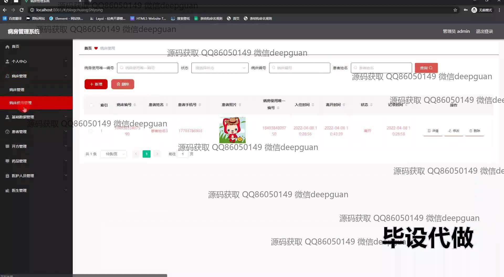
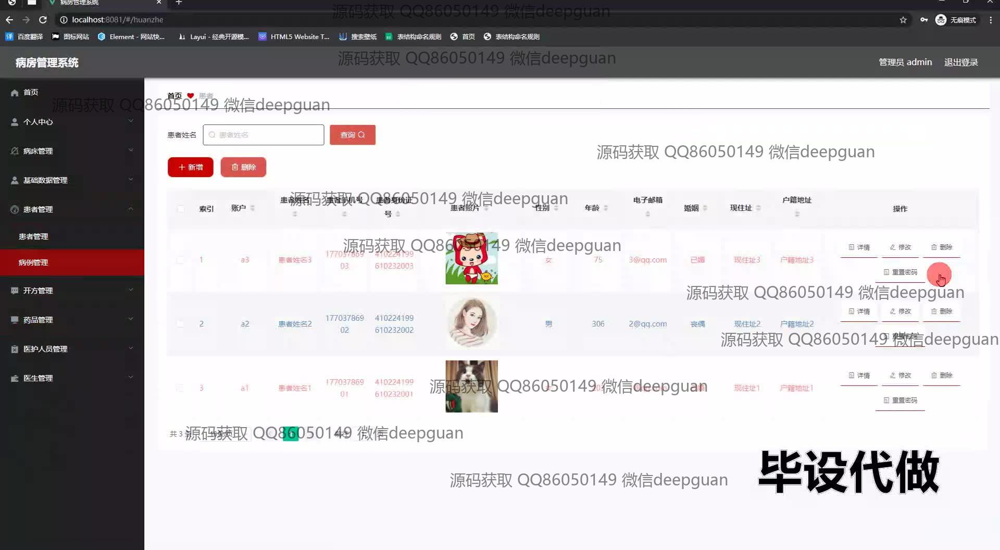
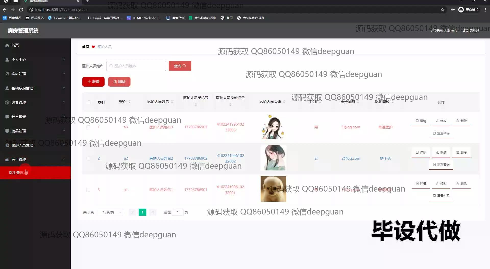
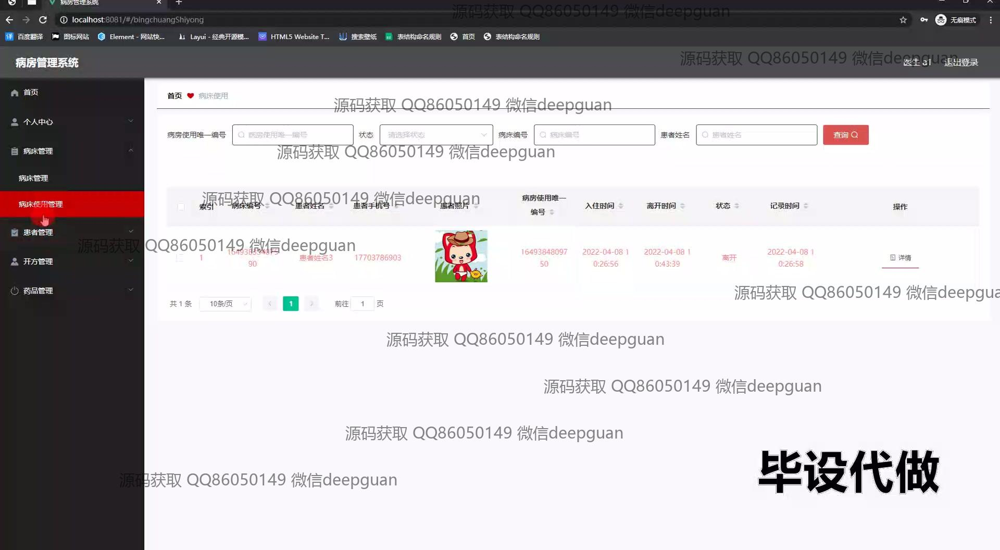
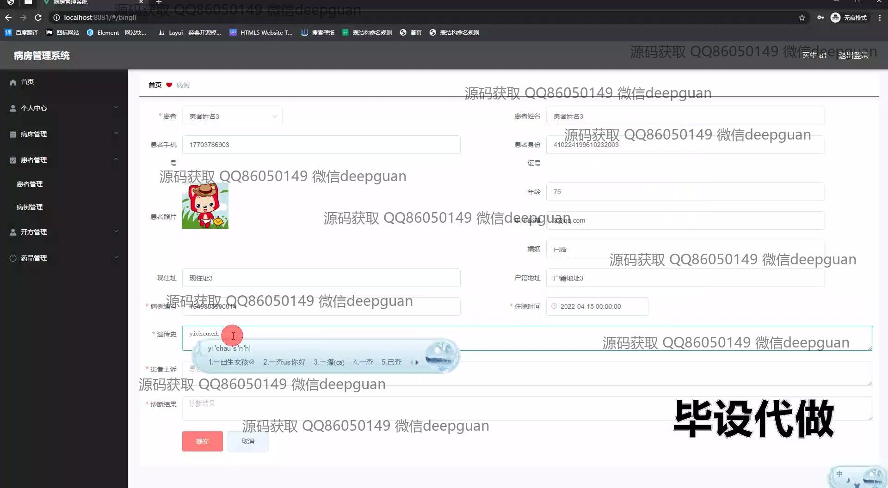
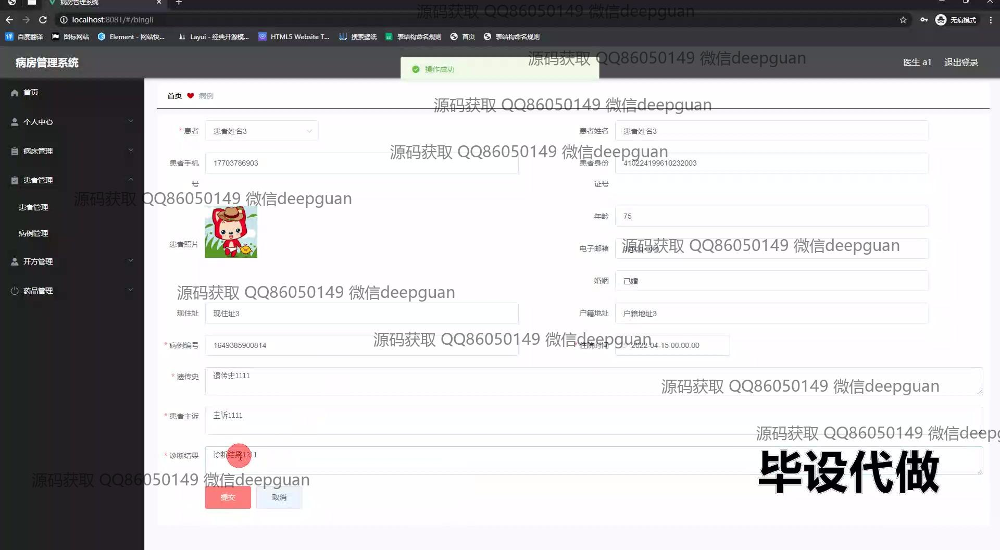
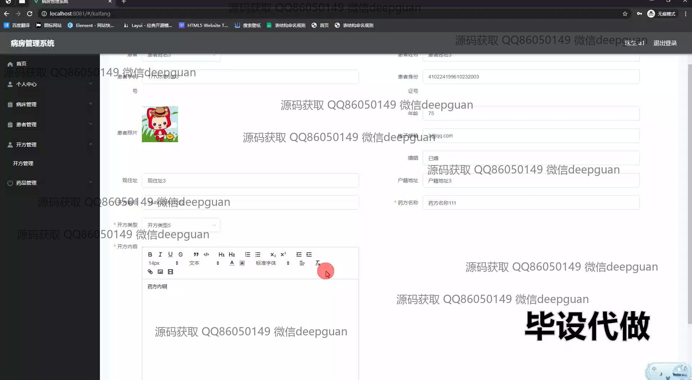
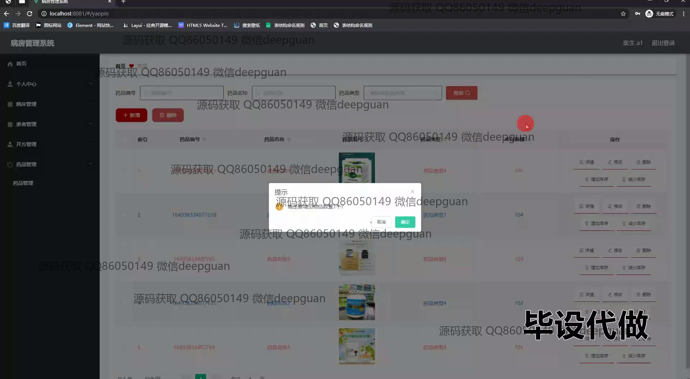
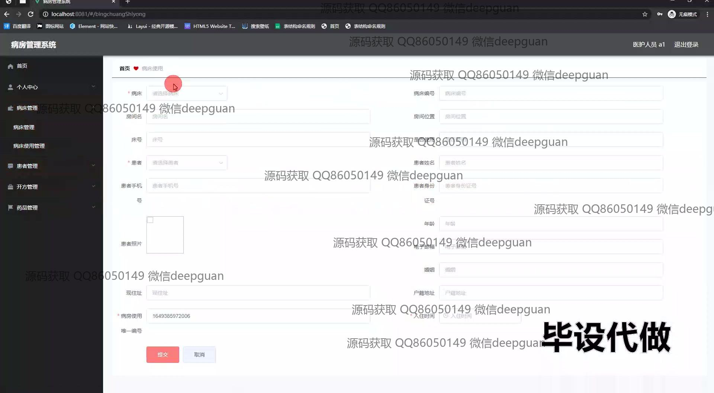
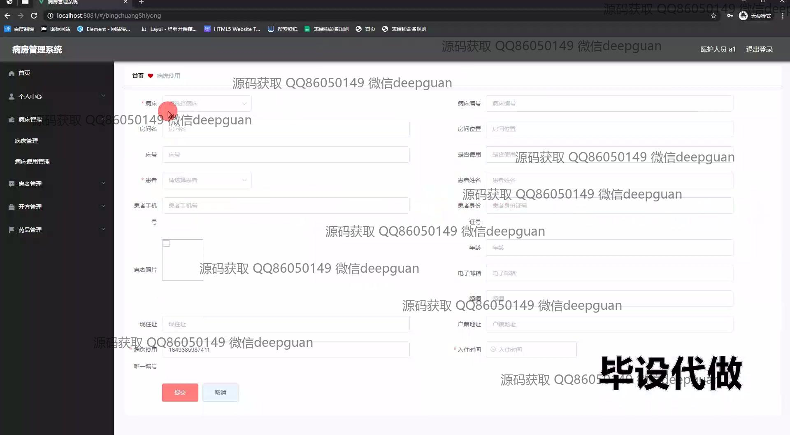
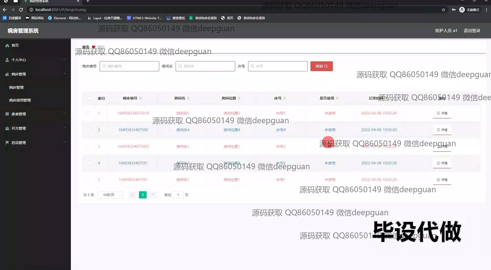
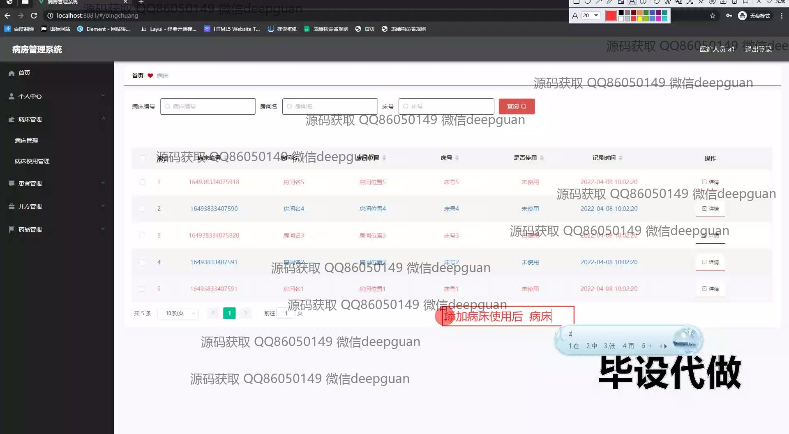
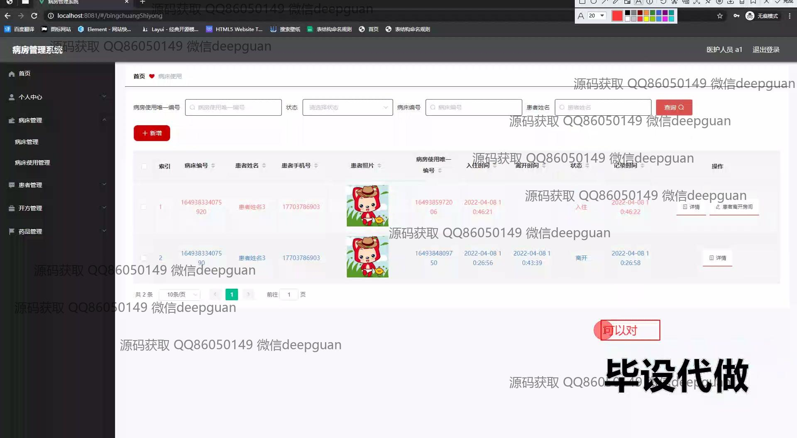
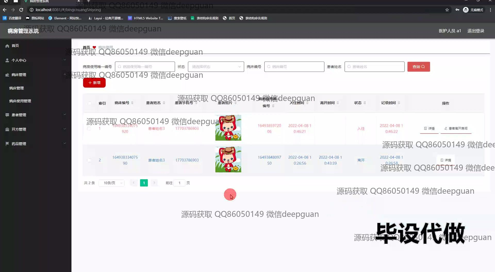
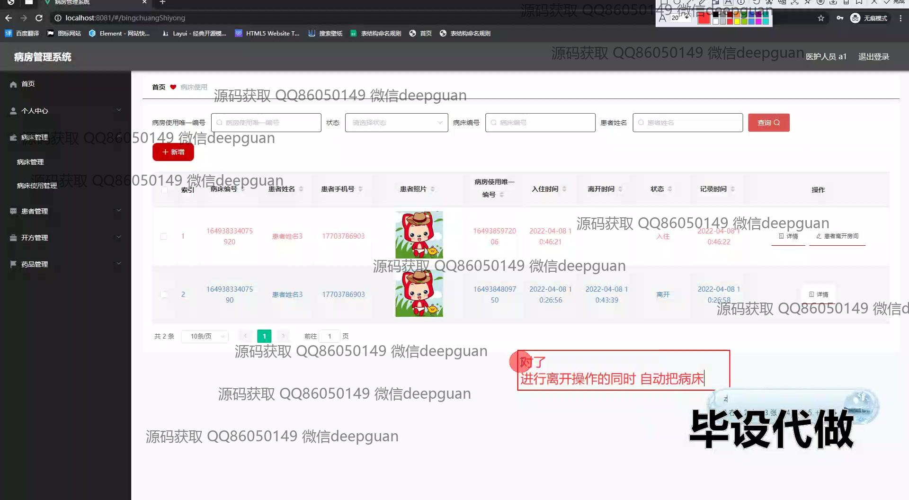
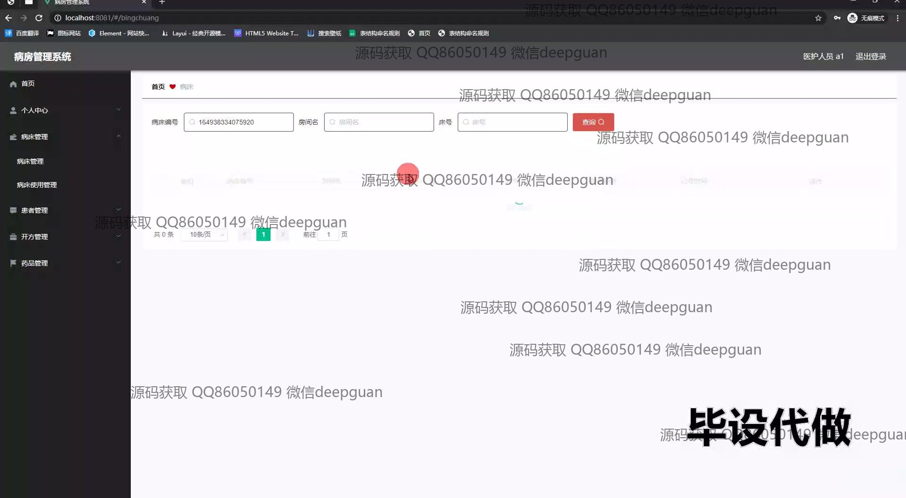
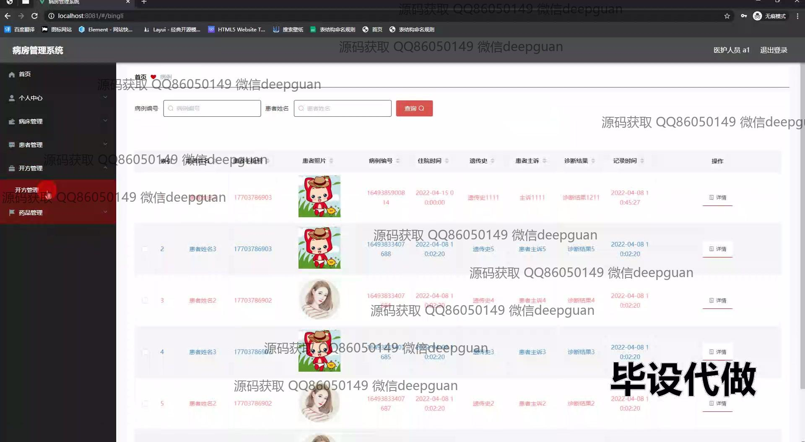
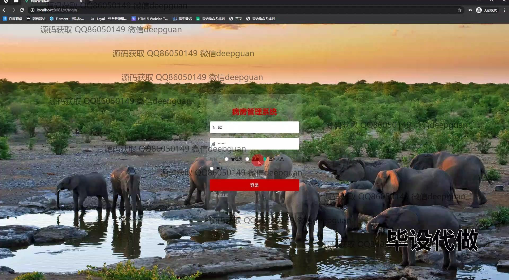
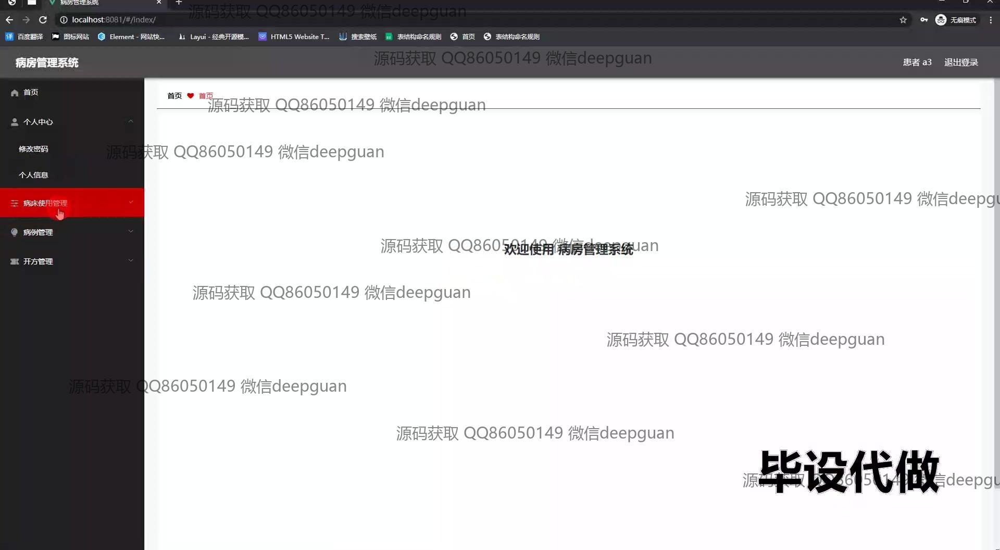

本代码来源于网络,仅供学习参考使用!

